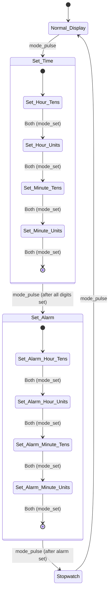

# Front-End Design: Watch Controller FSM

This subdirectory contains the Register-Transfer Level (RTL) front-end design of a 4-digit 24h-format watch controller.

---

## 1. System Overview

The watch controller is designed to implement four modes of operation utilizing a minimalist interface of two physical push-buttons (`mode` and `set`). The system operates at a scaled clock frequency for simulation and utilizes pulse-generation circuitry to handle button inputs reliably.

```
       +---------------------------------------------+
       |                  SYS_TOP                    |
       |                                             |
mode --+--> PULSE_GEN --> mode_pulse                 |
       |                                             |
 set --+--> PULSE_GEN --> set_pulse                  |
       |                      +                      |
       |                      v                      |
       |                     AND --> mode_set (Both) |
       |                                             |
       |  +------------+   +----------+              |
       |  |time_keeper |   |stopwatch |              |
       |  +------------+   +----------+              |
       |  +------------+   +----------+              |
       |  |Set_time    |   |Alarm_set |              |
       |  +------------+   +----------+              |
       |         \              /                    |
       |          v            v                     |
       |         +--------------+                    |
       |         |   Sys_ctrl   |                    |
       |         +-------+------+                    |
       |                 |                           |
       +-----------------+---------------------------+
                         |
                         v (Outputs: hours_1/2, minute_1/2, sound)
```

---

## 2. FSM Architecture

The main FSM is implemented in [Sys_ctrl.v](file:///d:/5%20th%20year/repo/01_Frontend_Design/rtl/Sys_ctrl.v) and governs the current operating mode of the watch.

### FSM State Descriptions
*   **Normal Display Mode:** Displays current hours and minutes from the timekeeper.
*   **Set Time Mode:** Increments digits of the current time sequentially (left-to-right).
*   **Set Alarm Mode:** Configures alarm activation time and enables the alarm sound.
*   **Stopwatch Mode:** Runs/pauses timer (mm:ss) and enables split-time latching.

### State Transitions Diagram


---

## 3. RTL Modules

The system is composed of the following modules located in the [rtl/](file:///d:/5%20th%20year/repo/01_Frontend_Design/rtl) directory:

1.  **[SYS_TOP.v](file:///d:/5%20th%20year/repo/01_Frontend_Design/rtl/SYS_TOP.v):** The top-level wrapper that instantiates and interconnects all submodules.
2.  **[Sys_ctrl.v](file:///d:/5%20th%20year/repo/01_Frontend_Design/rtl/Sys_ctrl.v):** The central FSM routing logic.
3.  **[time_keeper.v](file:///d:/5%20th%20year/repo/01_Frontend_Design/rtl/time_keeper.v):** Continuous timekeeper using cascaded counters.
4.  **[Set_time.v](file:///d:/5%20th%20year/repo/01_Frontend_Design/rtl/Set_time.v):** Digit adjustment logic for clock time.
5.  **[Alarm_set.v](file:///d:/5%20th%20year/repo/01_Frontend_Design/rtl/Alarm_set.v):** Stores and compares alarm parameters, outputting `sound` on match.
6.  **[stopwatch.v](file:///d:/5%20th%20year/repo/01_Frontend_Design/rtl/stopwatch.v):** Counts seconds and minutes for the stopwatch, handling pause and split.
7.  **[PULSE_GEN.v](file:///d:/5%20th%20year/repo/01_Frontend_Design/rtl/PULSE_GEN.v):** Level-to-pulse edge detection.
8.  **[Second_Detector.v](file:///d:/5%20th%20year/repo/01_Frontend_Design/rtl/Second_Detector.v):** Standard second pulse generator based on frequency divider.
9.  **[counter_hours.v](file:///d:/5%20th%20year/repo/01_Frontend_Design/rtl/counter_hours.v):** 24-hour rollover logic.
10. **[mod_counter.v](file:///d:/5%20th%20year/repo/01_Frontend_Design/rtl/mod_counter.v):** Reusable Mod-N counter cell.
11. **[mod_counter_sw.v](file:///d:/5%20th%20year/repo/01_Frontend_Design/rtl/mod_counter_sw.v):** Stopwatch-specific modular counter cell.
12. **[AND.v](file:///d:/5%20th%20year/repo/01_Frontend_Design/rtl/AND.v):** Detects simultaneous button presses.

---

## 4. Design Methodology

*   **Synchronous Design:** All state registers update on the positive edge of the system clock.
*   **Active-Low Asynchronous Reset:** The design uses `RST_N` for system initialization.
*   **Gray Coding:** The FSM state encodings utilize Gray code where applicable to minimize transition glitches and power consumption.
*   **Modular Hierarchical Design:** Kept logic separated into distinct functional blocks to ease testing and physical placement.

---

## 5. Front-End Results

The logic compiles cleanly in ModelSim compiler and synthesizes through Synopsys Design Compiler, showing:
*   Glitch-free state transitions under active button inputs.
*   Deterministic time Rollover behavior (e.g., unit minutes rollover to tens minutes, unit hours rollover to tens hours, and `23:59 -> 00:00`).

---

## 6. Team Members

*   **Abdelhamed Mahmoud** (RTL Design and FSM Architecture Lead)

---

## 7. Advisor

### Academic Advisor
**Dr. Diaa El-Din**

This work was completed under the supervision and guidance of Dr. Diaa El-Din, whose support and technical feedback were invaluable throughout the project.

---

## 8. Acknowledgements

Special thanks to **Eng. Abdelrahman Tamer** (Teaching Assistant) for his continuous assistance and feedback on the FSM design parameters.
