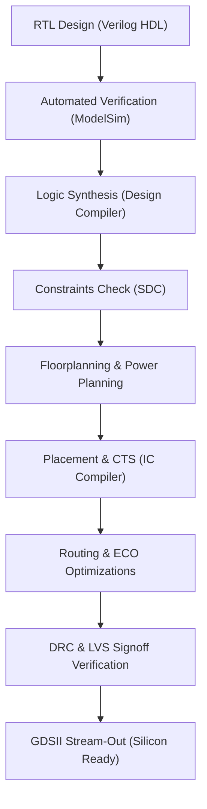

# MIPS16-RTL-to-GDSII: ASIC Design & Verification Portfolio

This repository represents a professional digital design engineering portfolio demonstrating the complete ASIC design flow from Register-Transfer Level (RTL) development and verification through to Physical Implementation (GDSII). 

The portfolio showcases two distinct ASIC implementation tracks:
1.  **Front-End Design & Verification Flow:** Implemented on a **4-Digit Watch Controller FSM** (featuring time-keeping, time-setting, alarm-setting, and stopwatch modes).
2.  **Back-End Physical Design Flow:** Implemented on a **16-bit MIPS Processor Core** (logic synthesis, floorplanning, placement, clock tree synthesis, routing, timing closure, and layout stream-out).

---

## 1. Overview

This portfolio showcases the ability to design high-performance digital logic and execute the physical implementation flow required for modern silicon manufacturing. By separating the repository into distinct logic design, verification, and physical layout phases, it mimics the divisions of an industrial ASIC tape-out flow.

---

## 2. Design Flow

The ASIC design flow utilized in this repository spans from high-level state machine specifications to silicon-ready layouts:

---

## 3. Front-End Design

The front-end design focuses on the behavioral modelling of a complex clock/timer FSM. 
*   **Target Design:** 4-digit 24h-format watch controller.
*   **Architectural Features:** Multi-mode operation (Normal Display, Set Time, Set Alarm, Stopwatch) with a 2-button input interface.
*   **Key Modules:** System Controller, Time Keeper, Stopwatch, Alarm Controller, Pulse Generators, Modular Counters.
*   For detailed schematics, state machines, and module interfaces, see the [Front-End Design README](file:///d:/5%20th%20year/repo/01_Frontend_Design/README.md).

---

## 4. Verification

The verification phase ensures the functional correctness of the FSM clock system using automated testing.
*   **Strategy:** Automated checking via a top-level testbench mimicking real-world button presses and timing cycles.
*   **Simulation Environment:** ModelSim Verilog/SystemVerilog simulations with wave layouts.
*   For test scenarios and simulation waveforms, see the [Verification README](file:///d:/5%20th%20year/repo/02_Verification/README.md).

---

## 5. Physical Design

The physical design flow translates the RTL description of a MIPS16 processor into physical layouts.
*   **Technology PDK:** Nangate 45nm Open Cell Library (NLDM SS corner, 0.95V, 125°C).
*   **Steps Executed:** Logical Synthesis, Core Floorplanning, Virtual PG Padding, Cell Placement, Clock Tree Synthesis (CTS), Routing, and LVS/DRC cleaning.
*   For scripts, constraint setups, and timing reports, see the [Physical Design README](file:///d:/5%20th%20year/repo/03_Physical_Design/README.md).

---

## 6. Results Summary

### FSM Functional Verification
*   **Time Keeping:** 100% accurate time progression.
*   **Stopwatch:** Fully operational split-time latching and resume.
*   **Alarm:** Zero-latency output sound trigger upon time match.

### MIPS16 Physical Layout Signoff
*   **Footprint Area:** **95,308 $\mu m^2$** (meets requirement of $\le 100,000 \mu m^2$).
*   **Clock Frequency:** **400 MHz** clock target fully closed (Setup Slack: **1.80 ns**).
*   **Hold Slack:** Closed at **0.00 ns** after buffer insertion.
*   **DRC Violations:** **0 DRC violations** and **0 open nets** in routing.

---

## 7. Tools and Technologies

*   **RTL Design & Simulation:** ModelSim, Verilog HDL, SystemVerilog
*   **Logic Synthesis:** Synopsys Design Compiler (DC)
*   **Physical Design (P&R):** Synopsys IC Compiler (ICC)
*   **Sign-Off Verification:** Calibre DesignRev (GDS merging)

---

## 8. Skills Matrix

| Skill | Front-End Design | Verification | Physical Design |
| :--- | :---: | :---: | :---: |
| **HDL Coding (Verilog/SV)** | **X** | **X** | |
| **FSM Architecture Design** | **X** | | |
| **Automated Testbenches** | | **X** | |
| **Waveform Debugging** | | **X** | |
| **Synthesis & Constraints (SDC)**| | | **X** |
| **Floorplanning & Power Grid** | | | **X** |
| **Clock Tree Synthesis (CTS)** | | | **X** |
| **Layout Route & DRC/LVS** | | | **X** |

---

## 9. Learning Outcomes

1.  **FSM State Routing and Minimization:** Gained deep understanding of encoding states in FSM design to avoid clock boundary hazards and reduce combinational logic width.
2.  **Clock Tree and Timing Closure:** Learned the importance of Clock Tree Synthesis in managing skew and latency to resolve hold time violations in high-frequency designs.
3.  **ASIC Manufacturing Constraints:** Experienced working within tight layout area boundaries, handling grid resolution requirements, and routing congestion management.

---

## 10. Challenges and Solutions

### Front-End: Input Debounce & Edge Detection
*   **Challenge:** Simple push-button inputs cause multi-cycle glitches due to state machine speeds, resulting in multiple transitions for a single button press.
*   **Solution:** Implemented pulse generator (edge-detection) modules that capture level transitions and generate a clean, single-cycle pulse for FSM mode switching.

### Physical Design: Timing Closure at 400 MHz
*   **Challenge:** Closing hold timing violations in standard cell logic paths due to clock networks delay variations.
*   **Solution:** Ran incremental Engineering Change Order (ECO) post-route optimizations to automate standard cell legalize placement and insert delay cells (buffers) in violating hold paths.

---

## 11. Team Members

*   **Abdelhameed Mahmoud Sayed** — *RTL Design, Functional Verification, and Physical P&R Design Lead*
*   **Mark Maher Eweida** — *Logic Synthesis, Timing Constraining, and Floorplanning Engineer*
*   **Abdullah Ahmed Youssef** — *FSM Architect and Testbench Development Specialist*

---

## 12. Academic Supervision

### Academic Advisor
**Dr. Diaa El-Din**
*Faculty of Engineering, Ain Shams University*

This work was completed under the supervision and guidance of Dr. Diaa El-Din, whose support, technical evaluations, and structural feedback were invaluable throughout the project.

---

## 13. Acknowledgements

We express our sincere gratitude to:
*   **Eng. Abdelrahman Tamer** (Teaching Assistant) for his continuous assistance, technical guidance, and support during the logic implementation and layout evaluation phases.
*   **Ain Shams University Faculty of Engineering** for providing the standard cell libraries and VM environments necessary to execute this ASIC flow.
*   Our team members, advisors, and peers whose collaborative feedback contributed to the success of this digital design and physical implementation.
